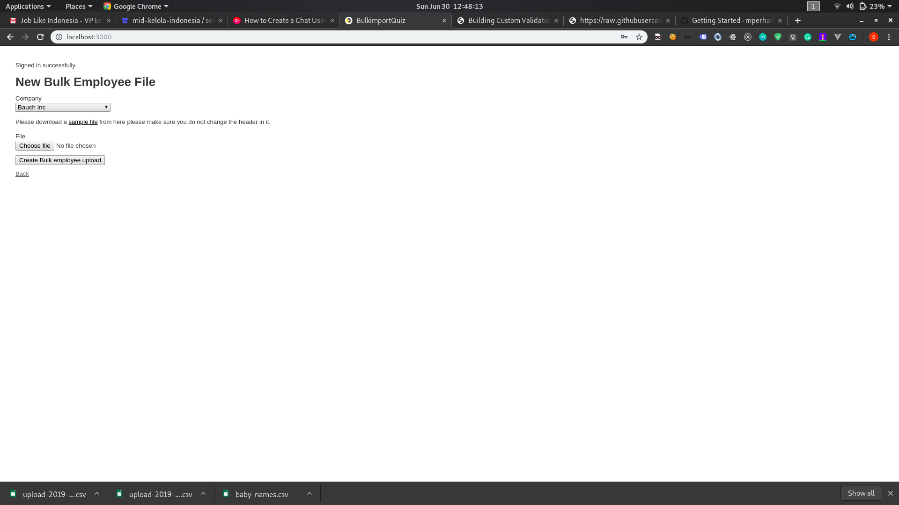
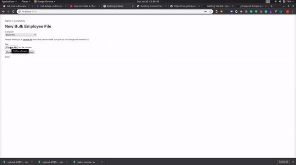

# Intro
This is a very basic app that holds a collection of companies data including its employee and leaves policy information. In this task, you will be required to develop new features according to the following user story.

## User story
As a user/admin, I want to be able to do bulk import by uploading a CSV file containing information of users and its policy so that I can save time onboarding users.

User can upload employee data by going to a new page. This new page will have a form that has 2 form input. The first one should be a drop down of the company. The second one should be the file form input in which user/admin can select the file. There is a sample csv data in the source code that you can refer to `spec/fixtures/valid_sample.csv`.

### Note
* User needs to select the company they are importing for from the web page
* Any new policy from the csv will be automatically created upon the import, eg. if Sick Leave policy does not exist in the company but it presents in the csv, then we should create the policy for Sick Leave
* The policy columns may contain multiple policies and separated by pipe (|)
* The column *Report To* is meant for the reporting line of employee. An employee can only report to another employee. The one who does not have reporting line is the BOSS

### Validation :

* Company should exist
* Should follow model validation (User and Policy)
* Only process csv file
* Reject if no csv file uploaded


### Definition of done :

* If valid file upload user should see success messages.
* If the user tries to upload a non-CSV file, it should say  that file is invalid
* If some of the information provided within CSV file not valid (violating model validation)
* It should be able to handle hundreds of thousands of records.
* Users should be able to find if any invalid data was entered.
---

## Objective :

* Develop the feature based on the requirement/user story
* Follow best practices (coding style, security etc)
* Ensure code readability and design for scalable, robust application.
* Write test RSpec for unit and integration. Both for existing and new features.
* You may install gems that you need
* You may change the current implementation if needed or make assumptions you want.
* Readme
---

# Solution
This is solution to users requirement. It has following prerequisites
* redis-server up and running on 5432.
* Make sure resque worker is running to run resque worker add following command in your teminal
```ruby
QUEUE=* rake resque:work
```
## Steps to run
* Run ```bundle install```
* Run ```rake db:setup```
* Start rails server
    - ```ruby
        rails s 
        ```
* Start resque worker by typing following commands in the console
    - ```ruby
        QUEUE=* rake resque:work
        ```
* Open [http://localhost:3000](https://localhost:3000) in your browser

You will see an authentication page, authenticate with email: admin@example.com password: password
After authentication following page will be shown:



In seeds.rb, code for generating fake company data is written, select any company from dropdowm, download sample file which is the same valid_sample.csv, user can download the sample and reupload it to check and if users want their own data all they need to do is keep the same header, change the file data and re-upload the file.

Once you click on upload, employee creation process triggered in background and the moment employee is created, the record created counter on the screen will increase automatically. When you click on click here to know more details link it will redirect users to a place where user can see all the employees created by the uploaded CSV file.

Similarly, if any occurs during the employee creation process the error counter will increase. When user clicks on click here to know more errors details, he will be redirected to a page where all the row with error in the csv file will listed.



On the errors details page user can download all the row with error in a csv file bby clicking on Generate CSV button.

